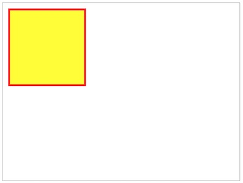
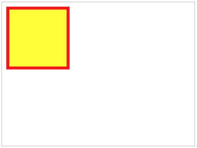
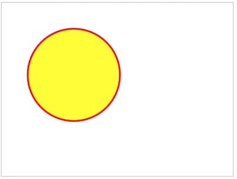
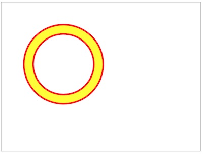
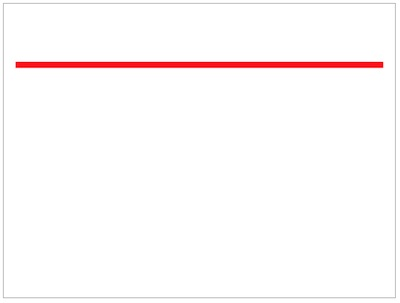
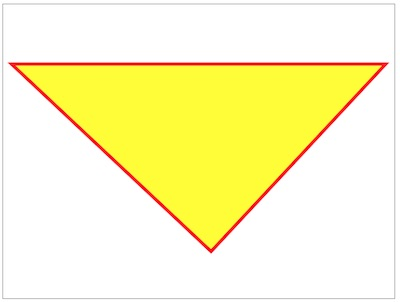
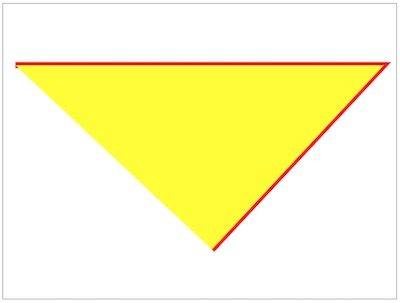
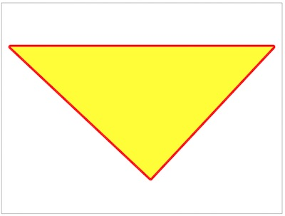
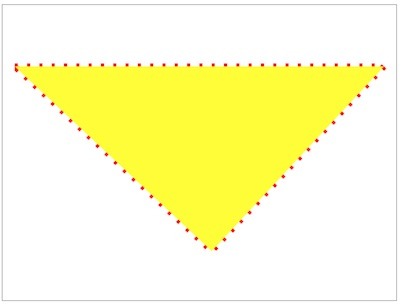
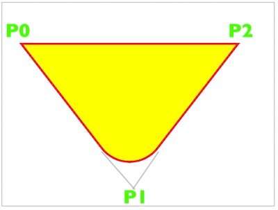

# Week 2A - JS Review and more Canvas

## I. Overview
Today we will: 
- Review:
  - JavaScript & DOM concepts from last week
  - how to set up a canvas drawing context, and how to draw:
    - rectangles
    - circles
    - straight lines
    - polygons
    - curved lines and shapes

## II. Required Reading & Assignments
* Shape Viewer HW -> [HW-shape-viewer.md](https://github.com/tonethar/IGME-330-Master/blob/master/notes/HW-shape-viewer.md)
* Study Guide-2 -> [HW-SG-2.md](https://github.com/tonethar/IGME-330-Master/blob/master/notes/HW-SG-2.md)
* Start file for today's demo is here -> [canvas-start.md](_files/canvas-start.md)

## III. Review of last week's JavaScript concepts <a id="review-questions"></a>

**You should be able to answer these questions!**

1. When writing JavaScript code in a web browser, what is the essential first step you must take before writing code that accesses HTML elements (i.e DOM elements) that are already on the page?
1. Which DOM method is used (in this course) to get a reference to a *single* HTML page element?
    * What are the possible return values(s) of this method?
1. Which DOM method (used in this course) is able to return references to *multiple* HTML page elements?
1. What are the names of 2 legacy DOM methods that are considered *deprecated* for this course, and we will not be using in any of our  assignments or projects?
1. What does `"use strict"` do? See these articles:
    * https://love2dev.com/blog/javascript-strict-mode/
    * https://developer.mozilla.org/en-US/docs/Web/JavaScript/Reference/Strict_mode
1. What is the JS keyword used to declare variables that are *block scoped*?
1. What is the JS keyword which declares a variable *globally*, or locally to an entire function (i.e. *function scoped*) regardless of the block it is declared in?
1. Which one of these 2 keywords are we going to use 99.9% of the time in this course when we want to declare a variable?
1. Write a function named `addThem`, that takes 2 arguments named `num1` and `num2`, and returns their sum
    * Now write another function named `addThem2` that works as above, but also gives `num1` and `num2` *default values* of `0`
    * Now write another function named `addThem3` that works the same as `addThem2`, but is instead declared as an ES6 arrow function
1. Write a function named `doStuff` that causes the second paragraph on an HTML page to have a pink background color, and for that paragraph's contents to be replaced with the text "Greetings and Felcitations"
1. Suppose we have a variable named `myButton` that references a DOM button. Write a JS *event handler* that will call function `doStuff` when the button is clicked
1. Now write *event listener* code that will do the same thing for `myButton`
1. Can JavaScript functions be thought of as a "First-class data type" and/or a ["First-class citizen"](https://en.wikipedia.org/wiki/First-class_citizen)

## IV. Canvas Presentation

  - **Why canvas?**
      - It's a stateful bitmap drawing API that is available on all modern web browsers - it's good to know how these kind of APIs work - as both iOS & Android have similar APIs for drawing
      
  - **Steps to getting a drawing context object**:
      - After the page loads, get a reference to a &lt;canvas> element: `let canvas = document.querySelector('canvas');`
      - Now get a reference to the drawing *context* like this: `let ctx = canvas.getContext('2d');`
      - `ctx` is a new `CanvasRenderingContext2D` object- this object has properties and methods that are listed here: https://www.w3.org/TR/2dcontext/#conformance-requirements
      - we could also turn the above 2 statements into a "one-liner" like this:
      
        `let ctx = document.querySelector('canvas').getContext('2d');`
      
  - **#1 - How to draw a rectangle**:
      - A) Optionally, `ctx.save()` (i.e. save or "push") the current value of all of the drawing state attributes so that you can easily restore them to their original values later. This also saves the CTM (current transformation matrix), which we will discuss soon
      
      - B) Optionally, set the drawing state attributes (properties) that you wish to have values other than the defaults - for example `ctx.lineWidth`, `ctx.strokeStyle`, `ctx.fillStyle`, `ctx.globalAlpha` - a full list of state properties is here: https://www.w3.org/TR/2dcontext/#the-canvas-state
      
      - C) Create a *path* for the rectangle like this:
      ```js
      ctx.beginPath();
      ctx.rect(x,y,width,height);
      ctx.closePath();
      ```
     - D) So we now have a path, but we can't see it. Now we need to stroke and/or fill the rectangular path like so. *Note that the order of these two calls **WILL** have an effect on the appearance of the drawing*:
     ```js
     ctx.stroke();
     ctx.fill();
     ```
     - E) Optionally, `ctx.restore()` the drawing context state properties and CTM to their previous values

The final version, which gives us a 200px by 200px yellow rectangle, with a 5 pixel thick (visible) red border, looks like this:

```js
let ctx = document.querySelector('canvas').getContext('2d');
ctx.save();                 // A - optionally, save the drawing state attributes and CTM
ctx.strokeStyle = "red";    // B - optionally, change the values of one or more drawing state attributes
ctx.fillStyle = "yellow";   // B
ctx.lineWidth = "10";       // B
ctx.beginPath();            // C - describe a path
ctx.rect(20,20,200,200);    // C
ctx.closePath();            // C
ctx.stroke();               // D - draw! i.e. make the path visible
ctx.fill();                 // D - swap the order of stroke() and fill() to see what happens to the drawing
ctx.restore();              // E - optionally, restore the saved values of drawing state attributes and CTM
```

\*\* ***Looks good, but note that we can only see 5 pixels of our 10-pixel stroke:*** \*\*



\*\* ***By flipping the order of the stroke and fill calls, in this case calling `ctx.stroke()` AFTER `ctx.fill()`, we can change how the drawing looks. Below we can now see the entire 10-pixels of the stroke:*** \*\*



 - **#2 - How to draw a circle**:
     - virtually identical to drawing a rectangle, just replace the path code - `ctx.rect()` - with:
       
       ```js
       ctx.beginPath(); 
       ctx.arc(x, y, radius, startAngle, endAngle, counterclockwise);
       ctx.closePath(); 
       ```
       
     - here's an example:
     
       ```js
       ctx.beginPath(); 
       ctx.arc(200, 200, 125, 0, Math.PI * 2, false); // draws a circle at 200,200 with a 125-pixel radius
       ctx.closePath();
       ctx.stroke();
       ctx.fill();  
       ```
 
 
 
 \*\* ***You can draw a 2D ring (or donut) shape by punching out the center. The trick is to create an arc with the `counterclockwise` value set to `true`  :*** \*\*
 
  ```js
       ctx.beginPath(); 
       ctx.arc(200, 200, 125, 0, Math.PI * 2, false); // draws a circle at 200,200 with a 125-pixel radius
       ctx.arc(200, 200, 100, 0, Math.PI * 2, true);  // punches out the center of the circle
       ctx.closePath();
       ctx.stroke();
       ctx.fill();  
 ```
 
  
 
 - **#3 - How to draw a line**:
     - just replace the path code - `ctx.rect()` - with:
     
       ```js
       ctx.beginPath(); 
       ctx.moveTo(20,100);  // start the "pen" at x=20, y=100 
       ctx.lineTo(620,100); // draw line to x=620, y=100
       ctx.closePath();
       ctx.stroke();
       ``` 
   

    
  - **#4 - How to draw a polygon**:
     - continue adding lines to our path:
     
       ```js
       ctx.beginPath(); 
       ctx.moveTo(20,100);  	// start the "pen" at x=20, y=100 
       ctx.lineTo(620,100); 	// point #1 -> draw line to x=620, y=100
       ctx.lineTo(340,400);	// point #2 -> draw line to x=340, y=400
       ctx.closePath(); 	// the path will automatically close back to point #1
       ctx.stroke();
       ctx.fill(); 
       ``` 



\*\* ***If we stroke the line BEFORE closing the path, then it won't "auto close". See below:*** \*\*

```js
ctx.beginPath();      
ctx.moveTo(20,100);
ctx.lineTo(620,100);  // point #1
ctx.lineTo(340,400);	// point #2
ctx.stroke();         // stroke the path before closing it
ctx.closePath(); 
ctx.fill();
```



\*\* ***If we set another drawing state attribute -  `ctx.lineJoin = "round";` - we get rounded corners. See below:*** \*\*



\*\* ***If we set the line dash pattern -  `ctx.setLineDash([5, 15]);` - we get a dashed line. See below:*** \*\*

- **The dashes are 5px long, and the spaces between the dashes are 15px**



  - **#5 - How to draw curvilinear shapes**:
    - To draw curves, we can use `ctx.arcTo(CP-1x, CP-1y, CP-2x, CP-2y, radius) // CP = "Control Point"` to build up a path.
    
    ```js
    ctx.beginPath();
    ctx.moveTo(50, 100);             	// P0
    ctx.arcTo(300, 425, 550, 100, 80); 	// P1, P2 and the radius
    ctx.lineTo(550, 100);               // top line: line segment between P0 & P2     
    ctx.closePath();
    ctx.stroke();               
    ctx.fill();             
    ```
    
    
    
    - these are some nice reference and interactives about `ctx.arcTo()` here:
      - https://developer.mozilla.org/en-US/docs/Web/API/CanvasRenderingContext2D/arcTo
      - https://www.rgraph.net/blog/an-interactive-example-of-the-html5-canvas-arcto-function.html
    - in SG-2, you will see how to draw [bezier curves](https://en.wikipedia.org/wiki/Bézier_curve) using `ctx. quadraticCurveTo()` and `ctx.bezierCurveTo()`
      
## V. Reference
- https://developer.mozilla.org/en-US/docs/Web/API/CanvasRenderingContext2D
- https://developer.mozilla.org/en-US/docs/Web/API/CanvasRenderingContext2D/setLineDash
- More on clipping: https://stackoverflow.com/questions/18988118/how-can-i-clip-inside-a-shape-in-html5-canvas

<hr><hr>

| <-- Previous Unit | Home | Next Unit -->
| --- | --- | --- 
| [**week-01B-notes.md**](week-01B-notes.md)     |  [**IGME-330 Schedule**](../schedule.md) | [**week-02B-notes.md**](week-02B-notes.md)
